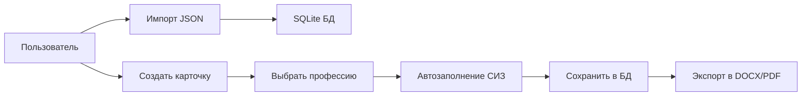

# СИЗ Менеджер (SIZ Manager)

**Автоматизация учета выдачи средств индивидуальной защиты**

---

## 📖 О проекте

Desktop приложение для Windows, автоматизирующее создание личных карточек учета выдачи СИЗ сотрудникам на основе **Приказа Минтруда РФ от 29.10.2021 N 767н**.

**Основная функция:** При выборе профессии сотрудника программа **автоматически заполняет** таблицу положенных СИЗ из справочника.

---

## ⚡ Основные возможности

- ✅ Импорт справочника профессий и СИЗ (2988 профессий)
- ✅ Автоматическое заполнение СИЗ при выборе профессии
- ✅ Создание и редактирование карточек сотрудников
- ✅ Экспорт карточек в **DOCX, PDF, Excel**
- ✅ Поиск по карточкам (ФИО, табельный номер, профессия)
- ✅ Portable версия (не требует установки)

---

## 🗂️ Структура проекта

```
SizManager/
├── .git/                                      # Git репозиторий
├── card_template_with_placeholders.docx       # Шаблон карточки
├── siz_database_full.json                     # База профессий (2988 шт)
├── TECHNICAL_SPECIFICATION.md                 # ⭐ Полное ТЗ
├── README.md                                  # Этот файл
└── SizManager/                                # C# проект (создается)
    ├── Models/
    ├── Views/
    ├── ViewModels/
    ├── Services/
    └── ...
```

---

## 🚀 Быстрый старт

### 1. Требования

- **Windows:** 10 или 11
- **.NET:** 8.0 SDK (или .NET Framework 4.8)
- **Visual Studio:** 2022 (или Claude Code)

### 2. Разработка

Откройте **TECHNICAL_SPECIFICATION.md** — там полное ТЗ с:
- Подробным описанием функций
- Схемой базы данных SQLite
- Структурой JSON
- Примерами кода
- Этапами разработки

### 3. Файлы в проекте

| Файл | Назначение |
|------|-----------|
| `TECHNICAL_SPECIFICATION.md` | **Полное техническое задание** |
| `card_template_with_placeholders.docx` | Шаблон Word для экспорта карточек |
| `siz_database_full.json` | Справочник профессий (4 МБ, 2988 профессий) |

---

## 📊 Данные

### Справочник профессий

**Файл:** `siz_database_full.json`

**Статистика:**
- Профессий: **2988**
- Записей СИЗ: **13 826**
- Средняя СИЗ на профессию: **4.6**
- Размер файла: **4.06 МБ**

**Формат:**
```json
{
  "metadata": {
    "version": "1.0",
    "date": "2026-02-23",
    "source": "Приказ Минтруда 767н от 29.10.2021",
    "total_professions": 2988
  },
  "professions": [
    {
      "number": "1",
      "name": "Авербандщик",
      "siz_list": [
        {
          "type": "Одежда специальная защитная",
          "name": "Костюм для защиты от механических воздействий (истирания)",
          "norm": "1 шт."
        }
      ]
    }
  ]
}
```

---

## 🛠️ Технологический стек

- **Язык:** C# 12.0
- **Framework:** .NET 8.0
- **UI:** WPF (MVVM)
- **БД:** SQLite + Entity Framework Core
- **Документы:** DocX, QuestPDF, EPPlus

---

## 📝 Архитектура

**Паттерн:** MVVM (Model-View-ViewModel)

```
Models/              # Модели данных (Profession, Employee, SIZ)
Views/               # XAML интерфейс
ViewModels/          # Логика представления
Services/            # Бизнес-логика (импорт, экспорт, БД)
```

### База данных SQLite

**Таблицы:**
1. `Professions` — справочник профессий
2. `ProfessionSIZ` — СИЗ для профессий
3. `Employees` — карточки сотрудников
4. `EmployeeSIZ` — СИЗ для сотрудников

---

## 📋 Основной workflow



**Детально:**
1. **Импорт:** `siz_database_full.json` → SQLite
2. **Создание карточки:** Ввод ФИО, выбор профессии
3. **Автозаполнение:** При выборе профессии → список СИЗ загружается из БД
4. **Сохранение:** Карточка сохраняется в SQLite
5. **Экспорт:** Генерация DOCX по шаблону `card_template_with_placeholders.docx`

---

## 🎯 Пример использования

### Сценарий: Создание карточки для электрика

1. Открываете программу
2. Нажимаете **"Новая карточка"**
3. Вводите ФИО: `Иванов Иван Иванович`
4. Начинаете вводить профессию: `Элек...`
5. Выбираете из списка: `Электрик`
6. **→ Таблица СИЗ заполняется автоматически:**
   - Костюм электрозащитный
   - Перчатки диэлектрические
   - Обувь специальная
   - и т.д.
7. Нажимаете **"Сохранить"**
8. Нажимаете **"Экспорт в DOCX"**
9. Получаете готовый Word документ для печати
